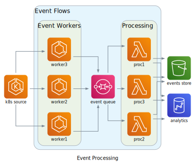

[](https://diagrams-js.hatemhosny.dev)

# diagrams-js

> A (vibe-coded) TypeScript/JavaScript port of the popular Python [diagrams](https://github.com/mingrammer/diagrams) library for drawing cloud system architecture diagrams as code.

[](https://www.npmjs.com/package/diagrams-js)
[](https://www.npmjs.com/package/diagrams-js)
[](https://github.com/diagrams-js/diagrams-js/actions/workflows/ci.yml)
[](https://opensource.org/licenses/MIT)

<a href="https://livecodes.io/?x=id/456y7h6in9s" target="_blank"></a>

## Features

- **Diagram as Code**: Define your architecture diagrams in TypeScript
- **17+ Cloud Providers**: AWS, Azure, GCP, Kubernetes, Alibaba Cloud, Oracle Cloud, IBM Cloud, and more
- **2000+ Node Classes**: Comprehensive coverage of cloud services and infrastructure components
- **Cross-Platform**: Works in browsers, Node.js, Deno and Bun
- **Multiple Output Formats**: SVG, PNG, JPG, and DOT
- **Type-Safe**: Full TypeScript support with comprehensive type definitions
- **WebAssembly Powered**: Uses a WebAssembly build of [Graphviz](https://graphviz.org) ([viz](https://github.com/mdaines/viz-js)) for fast, client-side rendering
- **Custom Nodes**: Support for external icons and images
- **Tree-Shakable**: Import only what you need

## Examples

[](./docs/static/examples/example3-event-processing.svg)

Check the [examples page](https://diagrams-js.hatemhosny.dev/docs/getting-started/examples) for a full list of examples.

## Interactive Playground

Check out the [playground](https://diagrams-js.hatemhosny.dev/playground) for a live demo of diagrams-js in your browser.

## Installation

```bash
# npm
npm install diagrams-js
```

## Quick Start

### Node.js / TypeScript

```typescript
import { Diagram } from "diagrams-js";
import { EC2, Lambda } from "diagrams-js/aws/compute";
import { RDS } from "diagrams-js/aws/database";
import { S3 } from "diagrams-js/aws/storage";
import { ALB } from "diagrams-js/aws/network";

const diagram = Diagram("AWS Architecture", { direction: "TB" });

// Create nodes with icons
const lb = diagram.add(ALB("Load Balancer"));
const web = diagram.add(EC2("Web Server"));
const api = diagram.add(Lambda("API"));
const db = diagram.add(RDS("Database"));
const storage = diagram.add(S3("Storage"));

// Connect them
lb.to(web).to(api);
api.to([db, storage]);

// Render to SVG
const svg = await diagram.render();
```

### Browser

```html
<script type="module">
  import { Diagram } from "https://esm.sh/diagrams-js";
  import { EC2 } from "https://esm.sh/diagrams-js/aws/compute";
  import { RDS } from "https://esm.sh/diagrams-js/aws/database";

  const diagram = Diagram("My Diagram");
  const web = diagram.add(EC2("Web Server"));
  const db = diagram.add(RDS("Database"));

  web.to(db);

  const svg = await diagram.render();
  document.body.innerHTML = svg;
</script>
```

## Documentation

📚 **Full documentation**: [https://diagrams-js.hatemhosny.dev](https://diagrams-js.hatemhosny.dev)

- [Getting Started](https://diagrams-js.hatemhosny.dev/docs/getting-started/installation)
- [Examples](https://diagrams-js.hatemhosny.dev/docs/getting-started/examples)
- [Guides](https://diagrams-js.hatemhosny.dev/docs/guides/diagram)
- [Providers](https://diagrams-js.hatemhosny.dev/docs/guides/providers)
- [Playground](https://diagrams-js.hatemhosny.dev/playground)

## Supported Providers

| Provider                                                                   | Description                              |
| -------------------------------------------------------------------------- | ---------------------------------------- |
| [AWS](https://diagrams-js.hatemhosny.dev/docs/nodes/aws)                   | Amazon Web Services nodes                |
| [Azure](https://diagrams-js.hatemhosny.dev/docs/nodes/azure)               | Microsoft Azure nodes                    |
| [GCP](https://diagrams-js.hatemhosny.dev/docs/nodes/gcp)                   | Google Cloud Platform nodes              |
| [Kubernetes](https://diagrams-js.hatemhosny.dev/docs/nodes/k8s)            | Kubernetes nodes                         |
| [OnPrem](https://diagrams-js.hatemhosny.dev/docs/nodes/onprem)             | On-premises infrastructure nodes         |
| [AlibabaCloud](https://diagrams-js.hatemhosny.dev/docs/nodes/alibabacloud) | Alibaba Cloud nodes                      |
| [DigitalOcean](https://diagrams-js.hatemhosny.dev/docs/nodes/digitalocean) | DigitalOcean nodes                       |
| [Elastic](https://diagrams-js.hatemhosny.dev/docs/nodes/elastic)           | Elastic Stack nodes                      |
| [Firebase](https://diagrams-js.hatemhosny.dev/docs/nodes/firebase)         | Firebase nodes                           |
| [Generic](https://diagrams-js.hatemhosny.dev/docs/nodes/generic)           | Generic computing nodes                  |
| [GIS](https://diagrams-js.hatemhosny.dev/docs/nodes/gis)                   | GIS nodes                                |
| [IBM](https://diagrams-js.hatemhosny.dev/docs/nodes/ibm)                   | IBM Cloud nodes                          |
| [OCI](https://diagrams-js.hatemhosny.dev/docs/nodes/oci)                   | Oracle Cloud Infrastructure nodes        |
| [OpenStack](https://diagrams-js.hatemhosny.dev/docs/nodes/openstack)       | OpenStack nodes                          |
| [Outscale](https://diagrams-js.hatemhosny.dev/docs/nodes/outscale)         | Outscale nodes                           |
| [Programming](https://diagrams-js.hatemhosny.dev/docs/nodes/programming)   | Programming language and framework nodes |
| [SaaS](https://diagrams-js.hatemhosny.dev/docs/nodes/saas)                 | SaaS application nodes                   |

View the [full list](https://diagrams-js.hatemhosny.dev/docs/guides/providers)

## Development

### Prerequisites

- Node.js 18+
- pnpm
- Vite+

### Setup

```bash
# Clone the repository
git clone https://github.com/diagrams-js/diagrams-js.git
cd diagrams-js

# Install dependencies
vp install

# Run tests
vp test

# Run checks (lint, format, types)
vp check

# Build the library
vp run build
```

## Contributing

We welcome contributions! Please see our [Contributing Guide](CONTRIBUTING.md) for details.

## Acknowledgments

This project is a TypeScript port of the excellent Python [diagrams](https://github.com/mingrammer/diagrams) library by [mingrammer](https://github.com/mingrammer).

## Support

- 📖 [Documentation](https://diagrams-js.hatemhosny.dev)
- 🐛 [Issue Tracker](https://github.com/diagrams-js/diagrams-js/issues)
- 💬 [Discussions](https://github.com/diagrams-js/diagrams-js/discussions)

---

## License

This project is licensed under the MIT License - see the [LICENSE](LICENSE) file for details.

## Sponsor 💚

Please consider [sponsoring the project](https://github.com/sponsors/hatemhosny), to support its ongoing development and maintenance, as well as help to ensure that it remains a valuable resource for the developer community.
