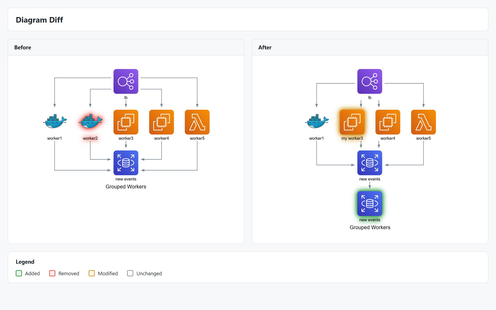

# Diagram Diff

Compare two versions of a diagram visually to see what changed. The diff feature highlights **added**, **removed**, and **modified** elements with color-coded overlays in a side-by-side view.



## Overview

When you version control your diagram code, you can see text diffs. But for architecture diagrams, a visual diff is much more useful:

- **Code reviews**: See exactly what infrastructure changed in a PR
- **Documentation**: Show evolution of system architecture
- **Auditing**: Track what was added or removed between deployments

## Quick Start

```typescript
import { Diagram, computeDiff, renderDiff } from "diagrams-js";
import { writeFileSync } from "fs";

// Load two versions of your diagram
const before = JSON.parse(await fs.readFile("arch-v1.json", "utf8"));
const after = JSON.parse(await fs.readFile("arch-v2.json", "utf8"));

// Compute the diff
const diff = computeDiff(before, after);
console.log(diff.summary);
// { added: 2, removed: 1, modified: 3, unchanged: 5 }

// Render visual diff as HTML
const html = await renderDiff(diff, before, after, { format: "html" });
await fs.writeFile("diff.html", html);
```

Or use the convenience static method:

```typescript
const html = await Diagram.renderDiff(before, after, { format: "html" });
```

## Computing Diffs

The `computeDiff` function compares two diagrams and returns a detailed diff result:

```typescript
import { computeDiff, type DiagramDiffResult } from "diagrams-js";

const diff: DiagramDiffResult = computeDiff(before, after);
```

### Diff Result Structure

```typescript
{
  // Map of node diffs by node ID
  nodes: Map<string, NodeDiff>;

  // Map of edge diffs by composite key
  edges: Map<string, EdgeDiff>;

  // Cluster diffs (recursive)
  clusters: ClusterDiff[];

  // Summary counts
  summary: {
    added: number;
    removed: number;
    modified: number;
    unchanged: number;
  };

  // Diagram-level changes (name, theme, direction, etc.)
  meta: {
    name?: { before?: string; after?: string };
    theme?: { before?: string; after?: string };
    direction?: { before?: string; after?: string };
    // ...
  };
}
```

### Node Diff Types

Each node in the diff has a `kind` indicating what changed:

| Kind        | Description                   | Has Before | Has After |
| ----------- | ----------------------------- | ---------- | --------- |
| `added`     | New node in after version     | ❌         | ✅        |
| `removed`   | Node deleted in after version | ✅         | ❌        |
| `modified`  | Node properties changed       | ✅         | ✅        |
| `unchanged` | No changes                    | ✅         | ✅        |

```typescript
const nodeDiff = diff.nodes.get("web-server");

if (nodeDiff?.kind === "modified") {
  console.log("Changes:", nodeDiff.changes);
  // ["label: \"Web\" → \"Web v2\"", "type: \"EC2\" → \"Lambda\""]
}
```

### Node Matching

Nodes are matched using a three-phase approach:

1. **Fingerprint Matching**: Nodes with identical `(label, provider, type, resource)` are matched directly
2. **Label Fingerprint + Edge Connectivity**: Unmatched nodes with same `(provider, type, resource)` are matched using edge connectivity to disambiguate multiple candidates
3. **Simple Label Fingerprint**: Remaining unmatched nodes are matched 1:1 by `(provider, type, resource)`

#### Label Change Detection

When nodes have the same `(provider, type, resource)` but different labels:

- **Same label** → `unchanged`
- **Different labels** → `modified` (label change)

This means if you rename a node (e.g., "worker1" → "worker1-prod") while keeping the same provider and type, it's detected as `modified` rather than `removed` + `added`.

**Note**: Nodes with completely different labels but same type are treated as separate nodes (removed + added), not modifications. The algorithm uses edge connectivity to determine if nodes should be paired.

## Rendering Diffs

The `renderDiff` function generates a visual representation:

```typescript
const html = await renderDiff(diff, before, after, options);
```

### Output Formats

#### HTML (Recommended)

Self-contained HTML page with:

- Side-by-side diagram panels
- Color-coded elements (green=added, red=removed, amber=modified)
- Summary header with change counts
- Legend
- Hover tooltips showing specific changes

```typescript
const html = await renderDiff(diff, before, after, {
  format: "html",
  theme: "light", // or "dark"
  layout: "side-by-side", // or "stacked"
  showLegend: true,
  showSummary: true,
  hoverDetails: true,
});
```

#### SVG

Combined SVG with both diagrams:

```typescript
const svg = await renderDiff(diff, before, after, {
  format: "svg",
  showLegend: true,
});
```

### Display Options

Control how unchanged elements appear:

```typescript
// Show unchanged elements normally (default)
{
  showUnchanged: "show";
}

// Dim unchanged elements
{
  showUnchanged: "dim";
}

// Hide unchanged elements entirely
{
  showUnchanged: "hide";
}
```

## Diff Options

Customize the diff computation:

```typescript
const diff = computeDiff(before, after, {
  // Ignore position/layout changes (default: true)
  ignore: { position: true },

  // Ignore all metadata changes
  ignore: { metadata: true },

  // Ignore specific metadata keys
  ignore: { metadata: ["cpu", "memory"] },

  // Ignore specific Graphviz attributes
  ignore: { attrs: ["color", "fillcolor"] },

  // Custom node matching function
  matchNodes: (a, b) => a.metadata?.resourceId === b.metadata?.resourceId,
});
```

## Complete Example

```typescript
import { Diagram, computeDiff, renderDiff } from "diagrams-js";
import { EC2, Lambda } from "diagrams-js/aws/compute";
import { RDS } from "diagrams-js/aws/database";
import { S3 } from "diagrams-js/aws/storage";
import { writeFileSync } from "fs";

// Version 1: Traditional architecture
const v1 = Diagram("Architecture v1", { direction: "TB" });
const web1 = v1.add(EC2("Web Server"));
const db1 = v1.add(RDS("Database"));
web1.to(db1);

// Version 2: Serverless migration
const v2 = Diagram("Architecture v2", { direction: "TB" });
const web2 = v2.add(Lambda("API Handler")); // Changed from EC2
const db2 = v2.add(RDS("Database")); // Same
const storage = v2.add(S3("Assets")); // New
web2.to(db2);
web2.to(storage);

// Compute and render diff
const diff = computeDiff(v1.toJSON(), v2.toJSON());

console.log("Changes:", diff.summary);
// Changes: { added: 1, removed: 0, modified: 1, unchanged: 1 }

const html = await renderDiff(diff, v1.toJSON(), v2.toJSON(), {
  format: "html",
  theme: "light",
  showUnchanged: "show", // or "dim" to dim unchanged, "hide" to hide them
});

writeFileSync("architecture-diff.html", html);
```

The resulting HTML will show:

- **Green**: New S3 "Assets" node
- **Amber**: Changed EC2 → Lambda node
- **Dimmed**: Unchanged RDS node

## Git Integration with CLI

Use the `diagrams` CLI for automatic diff generation in git workflows:

```bash
# Install globally
npm install -g @diagrams-js/cli

# Compare current file with HEAD
diagrams diff HEAD diagram.json -o diff.html

# Also compare SVG
diagrams diff HEAD diagram.svg -o diff.html

# Generate diff for PR
diagrams diff main...feature diagram.json -o diff.html

# Show in terminal (ASCII preview)
diagrams diff HEAD diagram.json --format terminal
```

### CLI Options

```bash
diagrams diff <ref> <file> [options]

Options:
  -o, --output <file>     Output file (default: <filename>-diff.html)
  -f, --format <format>   Output format: html, svg, json, terminal (default: html)
  -t, --theme <theme>     Theme: light, dark (default: light)
  -l, --layout <layout>   Layout: side-by-side, stacked (default: side-by-side)
  --show-unchanged        Show unchanged elements (default: true)
  --no-show-unchanged     Hide unchanged elements
  --ignore-position       Ignore position changes (default: true)
  --no-ignore-position    Include position changes
```

## Best Practices

1. **Export JSON for versioning**: Save `diagram.toJSON()` alongside your code for reproducible diffs:

   ```typescript
   await diagram.save("architecture.json", { format: "json" });
   ```

2. **Ignore cosmetic changes**: Use `ignore` options to focus on meaningful changes:

   ```typescript
   computeDiff(before, after, {
     ignore: { position: true, attrs: ["color"] },
   });
   ```

3. **Review metadata changes**: Infrastructure specs (CPU, memory) in metadata will be diffed by default. Review these in `nodeDiff.changes`.

## Troubleshooting

### Nodes showing as removed+added instead of modified

This is the expected behavior when:

- The node has a different `label` AND different edge connectivity
- The node has different `provider`, `type`, or `resource`

Nodes are only matched as `modified` when they share the same `(provider, type, resource)` and have matching edge connectivity patterns. If you rename a node and significantly change its connections, it will be treated as removed + added.

To force a match as modified, ensure the node keeps the same `provider`, `type`, `resource`, and similar edge connectivity.

### Edges not matching after node rename

Edges are matched using resolved node IDs. If a node is detected as modified, edges connected to it should still match. If not, check that the fingerprint matching succeeded.

### Layout changes cluttering the diff

Set `ignore: { position: true }` (default) to ignore layout/position changes and focus on structural changes.

## API Reference

### `computeDiff(before, after, opts?)`

Computes the diff between two diagram versions.

**Parameters:**

- `before`: `DiagramJSON | Diagram` — Original diagram
- `after`: `DiagramJSON | Diagram` — Updated diagram
- `opts?`: `DiffOptions` — Diff computation options

**Returns:** `DiagramDiffResult`

### `renderDiff(diff, before, after, opts?)`

Renders a visual diff.

**Parameters:**

- `diff`: `DiagramDiffResult` — Computed diff from `computeDiff()`
- `before`: `DiagramJSON | Diagram` — Original diagram
- `after`: `DiagramJSON | Diagram` — Updated diagram
- `opts?`: `RenderDiffOptions` — Rendering options

**Returns:** `Promise<string>` — HTML or SVG string

### `Diagram.diff(before, after, opts?)`

Static convenience method equivalent to `computeDiff()`.

### `Diagram.renderDiff(before, after, opts?)`

Static convenience method that computes and renders in one call.

## See Also

- [JSON Serialization](./json.mdx) — Export diagrams to JSON for diffing
- [Rendering](./rendering.mdx) — General rendering options
- [Diagram](./diagram.mdx) — Creating and configuring diagrams
